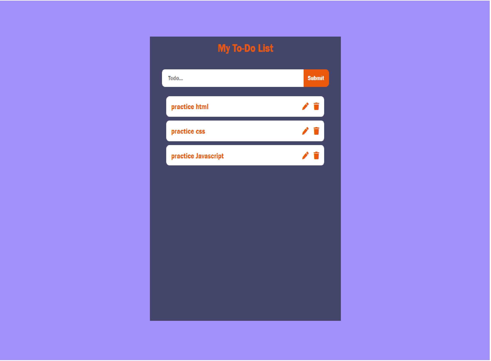

# My To-Do List App

A simple to-do list web application built with HTML, CSS and JavaScript.
Tasks can be added, edited, deleted, and are saved in the browser using localStorage.

## Features

- Add, edit and delete tasks
- Tasks are saved in localStorage for persistence
- New tasks appear at the top of the list (latest first)
- Form input is automatically cleared after submission

## UI Enhancement

- Icons (edit, delete) via [Font Awesome](https://fontawesome.com/)

## Demo

[Live Demo on Netlify](https://zesty-cat-660d95.netlify.app/)

## Screenshots

## Tech Stack

- HTML5
- CSS3
- JavaScript (ES6+)
- localStorage

## Why Use Class Structure?

While a simple to-do list can be implmented with basic functions and DOM manipulation,
this project was purposefully built using JavaScript ES6 class structure to practice:

- Object Oriented Programming
- Better code organisation
- Scalability for more features
- Separation of data logic and UI rendering
